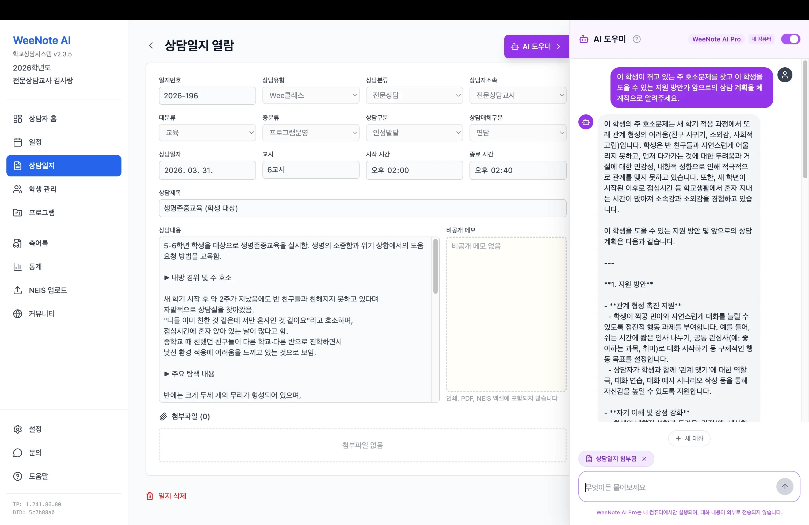
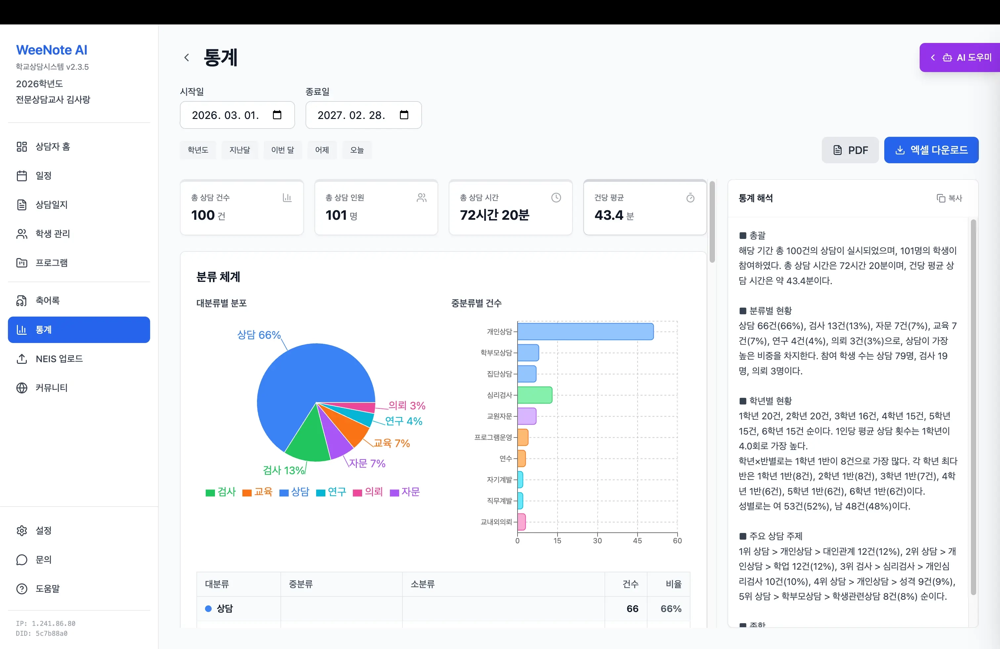
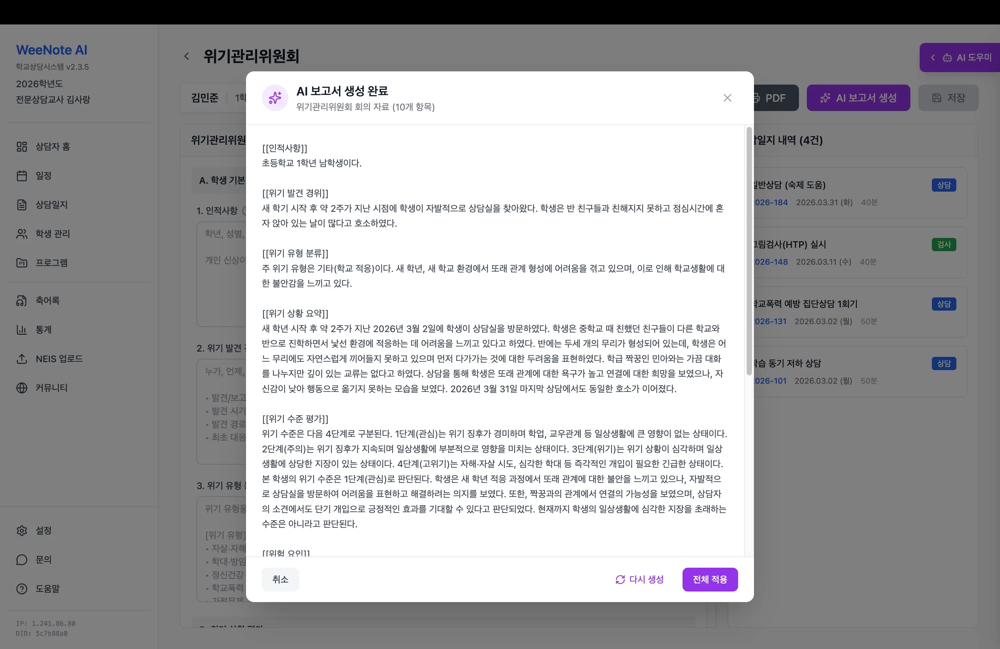
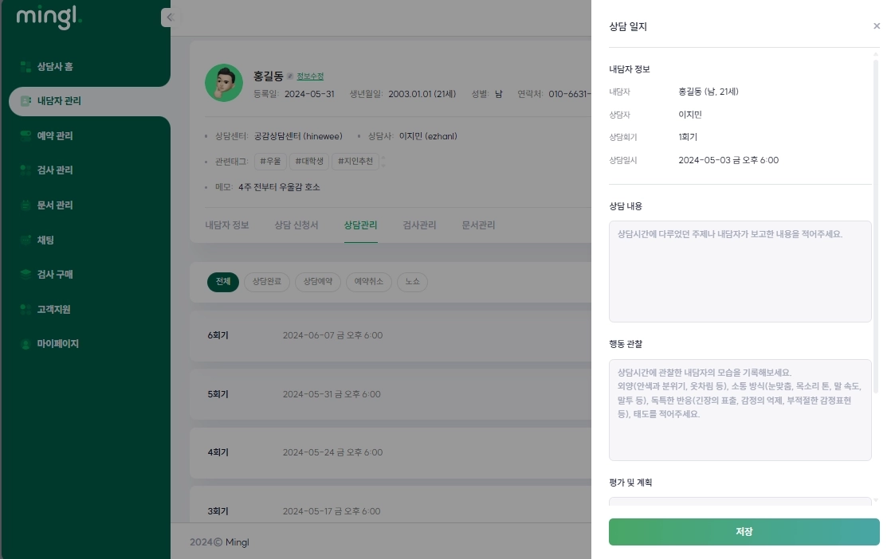

### 시장 조사

- 위노트: 위클래스 상담시스템 - https://weenote.kr/
    - 타겟: 학교 상담 선생님
    - 우리 서비스의 차별점: 타겟
    - 주요기능
        - 학생 관리
        - **상담 일지 관리**
            
            
            
        - 일정 관리
        - **위클래스 상담 보고서 자동 생성**
            
            
            
        - **AI 상담 어시스턴트**
            
            
            
- 밍글: 상담 예약, 문서, 검사 관리 플랫폼 - https://mingl.kr/
    - 타겟: 내담자-상담사 모두
    - 우리 서비스의 차별점: 우리는 상담일지 + 텍스트 분석 대시보드, RAG, 로컬 llm
    - 주요 기능
        - 내담자 관리 및 dm
        - 상담 일지 관리
            
            
            
        - 예약관리
        - 심리 검사 결과 관리
        - **심리 검사 결과 해석 챗봇**